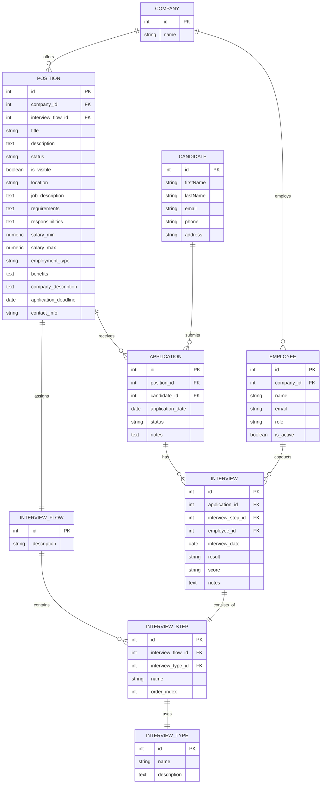

# Historial de Prompts

## Fecha: 27/12/2025

### Prompt 1: Análisis de workspace y configuración de registro de prompts

Como experto desarrollador de aplicaciones con persistencia en postgres y prisma para la ejecución de migraciones, quiero que analices el workspace completo de este proyecto, sobre todo focalizate en la estructura de base de datos existente porque el siguiente paso será analizar un evolutivo sobre de base de datos postgres que debemos preparar. Quiero que a partir de ahora todos los prompts que te indique, a parte de ejecutar sus instrucciones, hagas copia de los mismos en el archivo #file:prompts.md.

---

### Prompt 2: Generación de script SQL desde diagrama ERD Mermaid

En primer lugar dispongo de un diagrama ERD en formato mermaid donde se expande la estructura de datos respecto de la existente. En primer lugar necesito que generes un script sql basado en el diagrama mermaid que te paso para una base de datos postgres. Este script no debe seguir al pie de la letra el digrama mermaid sino que deberá aplicar las buenas prácticas que un experto en postgres aplicaría sobre el mismo, como la normalización de la base de datos, la definición de índices y en general la optimización de la misma según tu experiencia. Este es el diagrama mermaid:

---

### Prompt 3: Integración del evolutivo con estructura existente y generación de migraciones Prisma

En base al script generado #file:evolutivo_ats_system.sql  quiero que sobre la estructura de datos existente que previamente has analizado integres las nuevas tablas y sobre la que ya existen apliques las nuevas propiedades que surgen del evolutivo. Es posible que sobre la estructura resultante se le deban aplicar buenas prácticas como experto de base de datos que eres. Revisa sobre la estructura de datos final si se requiere la creación de índices o la normalización de datos. Finalmente quiero que generes las migraciones de prisma que me permitan expandir la estructura de datos a mi base de datos postgres.

---

### Prompt 4: Validación de compatibilidad y ejecución de migraciones

A continuación quiero que analices el @workspace para determinar que los cambios de estructura de datos no afecten a las funcionalidades actuales ya implementadas que interactuen con la base de datos. Si existe cualquier problema con los nuevos cambios de base de datos debe prevalecer la funcionalidad actual sobre los cambios que hemos aplicado de base de datos y todo debe seguir funcionando. Una vez me confirmes este punto deberás lanzar las migraciones de prisma ya que tengo el contenedor de postgres funcionando y podrás realizar el despliegue.
